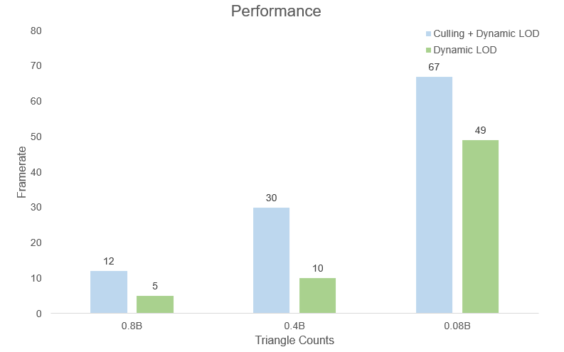

# Danite
Nanite is a virtualized geometry techonlogy based on dynamic Level of Detail(LOD), introduced in Unreal Engine 5.
Danite analyzes Nanite's architecture and implements a similar system using Vulkan, leveraging mesh shading techniques.

### Key Features
- GPU Driven Rendering
- BVH Cluster Culling
- Hi-Z Buffer
- Frustum & Occlusion Culling

### Skills and Tools
- Vulkan(EXT_mesh_shader), GLFW
- C++ 20
- tiny_obj_loader
- meshoptimizer
- METIS
- ImGUI
- NVIDIA Nsight Graphics

# System

In Danite, the CPU performs preprocessing on the input 3D model, The GPU then renders the scene based on the preprocessed data.

### Clustering
The 3D model is divided into meshlets, During this process, I referred [this guide](https://github.com/zeux/meshoptimizer?tab=readme-ov-file#mesh-shading) and make all meshlets less then 124 triangles.
this guide and ensured that each meshlet contains no more than 124 triangles.

Then, I used METIS to group adjacent meshlets and performed simplification to generate higher level nodes for LOD.

Based on the generated nodes, I built a Bounding Volume Hierarchy(BVH) for culling and LOD selection. Both meshoptimizer and METIS were used in this step.

Below is a comparison between different LOD levels.

### Shading
The renderer first draws the preprocessed model. For each cluster, it performs culling and calculates the appropriate LOD level. During the culling step, the Hi-Z buffer from the previous frame is used to perform occlusion culling. This entire pipeline is GPU Driven so fully executed on the GPU.

After rendering, a new Hi-Z buffer is generated using a compute shader, which will be used in the next frame for culling.

# Result
### Performance
- Test environment : CPU : Intel i5-12400F, GPU : RTX 3080

### Known Issues
- Occasionally, distant meshlets appear to flicker. This issue is suspected to be caused by floating point precision error or lack of synchronization, but it has not been resolved yet.
- Two-pass occlusion culling is not implemented. Additional optimization is expected by incorporating a second occusion pass.
- Mesh compression and streaming are not considered. The system is currently focused on handling large-scale triangle rendering, so these features are omitted.

# References
- [Understanding Nanite - Unreal Engine 5's new virtualized geometry system](https://www.unrealengine.com/ko/blog/understanding-nanite---unreal-engine-5-s-new-virtualized-geometry-system)
- [A Deep Dive into Nanite Virtualized Geometry](https://www.youtube.com/watch?v=eviSykqSUUw)
- [METIS](https://github.com/KarypisLab/METIS)
- [Introduction to Turing Mesh Shaders](https://developer.nvidia.com/blog/introduction-turing-mesh-shaders/)
- [Mesh Shading for Vulkan](https://www.khronos.org/blog/mesh-shading-for-vulkan)
- [LearnOpenGL](https://learnopengl.com/)
